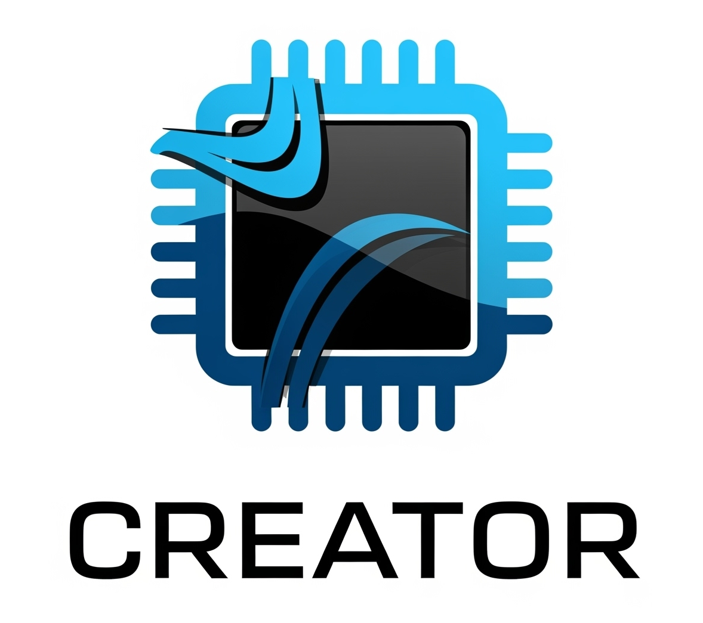

# Integrated development environment for teaching and research on RISC-V processors

|                              | URL                                             | 
|:----------------------------:|:------------------------------------------------| 
| Creator                      | https://creatorsim-community.github.io/creator/ |
| Source code                  | https://github.com/creatorsim-community/creator | 

<p align="center">
    
</p>


## Publications

### 2025

<details>
<summary>:newspaper: Simulador web para RISC-V basado en la especificación SAIL</summary>

  * Conference paper: Jornadas Sarteco
  * Authors: Juan Carlos Cano-Resa, Félix García-Carballeira, Diego Camarmas-Alonso, Alejandro Calderón-Mateos
  * [:link: Open publication](http://dx.doi.org/10.5281/zenodo.15773218)
  ```bash
  @inproceedings{cano_resa_2025_15773218,
  author = {Cano Resa, Juan Carlos and Garcia Carballeira, Felix and Camarmas Alonso, Diego and Calderon Mateos, Alejandro},
  title = {Simulador web para RISC-V basado en la especificación SAIL},
  booktitle = {Avances en Arquitectura y Tecnología de Computadores. Actas de las Jornadas SARTECO},
  year = 2025,
  pages = {367-376},
  publisher = {Zenodo},
  month = jun,
  venue = {Sevilla, Spain},
  doi = {10.5281/zenodo.15773218},
  url = {https://doi.org/10.5281/zenodo.15773218}}
  ```
</details>

<details>
<summary>:newspaper: Extensión del simulador CREATOR para integrar funcionalidades de Arduino: caso de estudio con el microcontrolador ESP32</summary>

  * Conference paper: Jornadas Sarteco
  * Authors: Elisa Utrilla-Arroyo, Diego Camarmas-Alonso, Félix García-Carballeira, Alejandro Calderón-Mateos
  * [:link: Open publication](http://dx.doi.org/10.5281/zenodo.15773284)
  ```bash
  @inproceedings{utrilla_arroyo_2025_15773284,
  author = {Utrilla Arroyo, Elisa and Camarmas Alonso, Diego and Garcia Carballeira, Felix and Calderon Mateos, Alejandro},
  title = {Extensión del simulador CREATOR para integrar funcionalidades de Arduino: caso de estudio con el microcontrolador ESP32},
  booktitle = {Avances en Arquitectura y Tecnología de Computadores. Actas de las Jornadas SARTECO},
  year = 2025,
  pages = {637-643},
  publisher = {Zenodo},
  month = jun,
  venue = {Sevilla, Spain},
  doi = {10.5281/zenodo.15773284},
  url = {https://doi.org/10.5281/zenodo.15773284}}
  ```
</details>


### 2024

<details>
<summary>:newspaper: CREATOR: An Educational Integrated Development Environment for RISC-V Programming</summary>

  * Journal paper: IEEE Access
  * Authors: Diego Camarmas-Alonso, Félix García-Carballeira, Alejandro Calderón-Mateos, Elías Del-Pozo-Puñal
  * [:link: Open publication](https://doi.org/10.1109/ACCESS.2024.3406935)
  ```bash
  @ARTICLE{10540579,
  author={Camarmas-Alonso, Diego and Garcia-Carballeira, Felix and Calderon-Mateos, Alejandro and Del-Pozo-Puñal, Elias},
  journal={IEEE Access},
  title={CREATOR: An Educational Integrated Development Environment for RISC-V Programming},
  year={2024},
  volume={},
  number={}, 
  pages={1-1},
  doi={10.1109/ACCESS.2024.3406935}}
  ```
</details>

<details>
<summary>:newspaper: Servicio de laboratorio remoto para la integración del simulador CREATOR con hardware RISC-V</summary>

  * Conference paper: Jornadas Sarteco
  * Authors: Diego Camarmas-Alonso, Félix García-Carballeira, Alejandro Calderón-Mateos, Elías Del-Pozo-Puñal
  * [:link: Open publication](https://doi.org/10.5281/zenodo.11632954)
  ```bash
  @inproceedings{camarmas_alonso_2024_11632955,
  author = {Camarmas-Alonso, Diego and Garcia-Carballeira, Felix and Calderon-Mateos, Alejandro and Del-Pozo-Puñal, Elías},
  title = {{Servicio de laboratorio remoto para la integración del simulador CREATOR con hardware RISC-V}},
  booktitle = {{Avances en Arquitectura y Tecnología de Computadores. Actas de las Jornadas SARTECO}},
  year = 2024,
  pages = {65-371},
  publisher = {Zenodo},
  month = jun,
  venue = {A Coruña, Spain},
  doi = {10.5281/zenodo.11632955},
  url = {https://doi.org/10.5281/zenodo.11632955}}
  ```
</details>


## Seminars

### 2025

<details>
<summary>:newspaper: CREATOR: un entorno de desarrollo integrado para la docencia y la investigación en procesadores RISC-V</summary>

  * Seminar: CAPAP-H
  * Authors: Diego Camarmas-Alonso
  * [:link: Slides](https://creatorsim.github.io/content/publications/creator_capap_h_2025.pdf)
</details>

